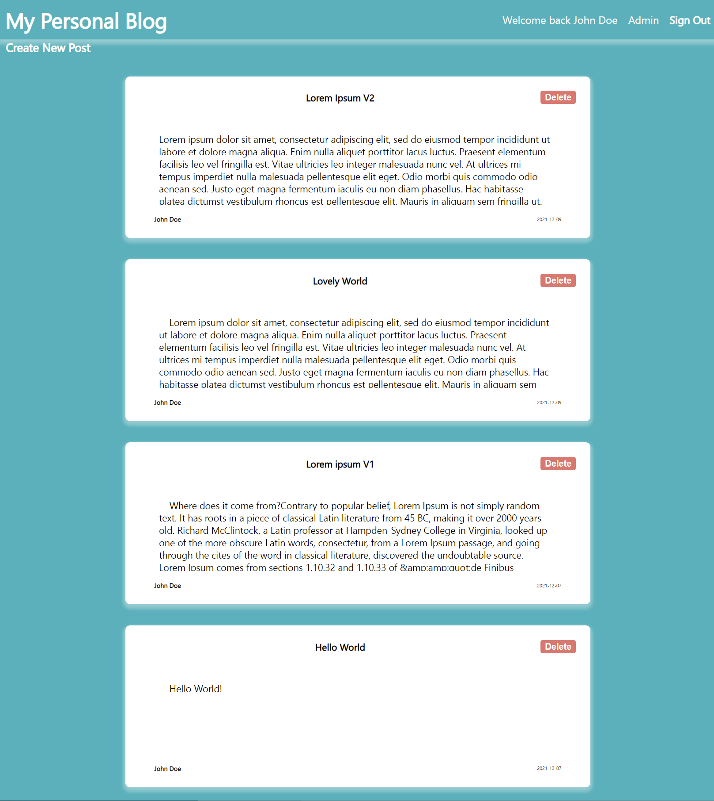

# Blog API Client-side

# Description

         A blog API client-side.
         It is the client-side of the full-stack BLOG web application, mainly using React.

[<h2>Live Demo</h2>](https://samgliu.github.io/THO-blog-api-client/)

# Repositories

Server repository:https://github.com/samgliu/THO-blog-api  
Server API Demo:https://top-blog-api.onrender.com

Client repository:https://github.com/samgliu/THO-blog-api-client  
Client Demo:https://samgliu.github.io/THO-blog-api-client/

# Built With

-   React

# Feature:

Create User  
Log in/out  
Auth  
Post  
Comment
Edit  
Server/Client/
RESTful

# Usage:

Upgrading to admin gives user post/edit/delete authorization.  
Anyone can comment.
